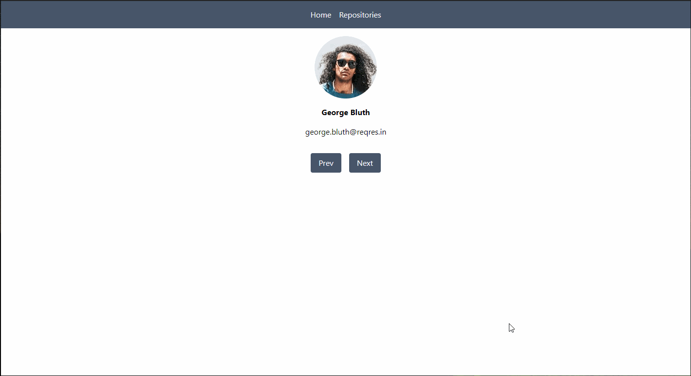

# ReqRes API Test

Aplicação simples feita com ReactJS com o intuito de testar a API [ReqRes](https://reqres.in) justamente com as funcionalidades do biblioteca React Query.

## ✨ Preview

## 🛠 Builded with

##  About me

- 👤 Bacharel em jornalismo se aventurando pelo mundo da programação, estudando stacks relacionadas ao front-end, focado em ReactJS

- 🔭 Me encontre:  
